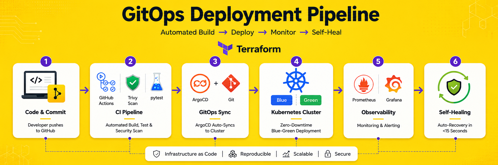

# DevOps Platform Engineering: GitOps, Blue-Green Deployments & Automated Incident Recovery

A self-healing, GitOps-driven Kubernetes deployment platform demonstrating core **Site Reliability Engineering (SRE)** practices built solo, end-to-end, and stress-tested through deliberate **Chaos Engineering** failure injection, with formal incident postmortems and measured **Mean Time To Recovery (MTTR)**.

**Stack:** Kubernetes · ArgoCD · Terraform · Docker · Prometheus · Grafana · GitHub Actions · Trivy · Kustomize · Helm · GitOps

🔗 **Repo:** [github.com/bakhtalisp/devops-platform-project](https://github.com/bakhtalisp/devops-platform-project)

<p align="center">
    
</p>

---

## Overview

This project implements a production-style GitOps deployment pipeline on Kubernetes covering CI/CD, **zero-downtime** blue-green traffic switching, GitOps-based self-healing via ArgoCD, full observability, and **immutable infrastructure as code**, then validates every safety mechanism by deliberately breaking the system and documenting the recovery with real, measured numbers.

## Key Highlights

- Built and deployed a complete GitOps pipeline using ArgoCD with `selfHeal` and auto-prune enabled, enforcing Git as the single source of truth for cluster state **verified via a live drift-correction test** (manual `kubectl scale` reverted automatically within the sync interval).
- Implemented **zero-downtime blue-green deployments** with Git-committed traffic-switch rollback, backed by Kubernetes readiness probes as an independent, automated safety net two distinct layers of deploy protection.
- Designed and provisioned **22 AWS resources** (VPC, EKS, EC2, S3, IAM) using modular, **immutable Terraform infrastructure as code**, following a full apply → verify → destroy discipline to prove IaC competency without incurring ongoing cloud costs.
- Built a full observability stack (Prometheus, Grafana, Alertmanager) with custom alerting rules that independently surfaced both injected incidents below mirroring how an on-call engineer would first detect a production issue.
- Validated system resilience with two deliberate **Chaos Engineering** failure injections (OOM crash, failed health check). Both recovered automatically in **under 15 seconds** with **zero manual intervention** documented in formal postmortems with root cause, timeline, and MTTR.
- Automated CI pipeline (GitHub Actions) running unit tests and Trivy container vulnerability scanning (**shift-left security**) on every push, averaging **~49 seconds** per run.
- Applied a **zero-trust, default-deny network policy baseline** across namespaces, including a documented, verified finding on a CNI-level enforcement gap (see [Security & Hardening Roadmap](#security--hardening-roadmap)).

---

## Architecture

```
devops-platform-project/
├── docs/                       # requirements, postmortem, architecture + proof screenshots
├── terraform/
│   ├── modules/                # vpc, ec2, s3, security-group
│   └── environments/dev/       # environment-specific config, state
├── k8s/
│   ├── base/                   # deployments, services, network policies
│   └── overlays/dev/           # kustomize overlay tracked by ArgoCD
├── argocd/application.yaml     # GitOps sync definition (selfHeal + auto-prune)
├── .github/workflows/ci.yml    # CI: pytest + Trivy container vulnerability scan
├── monitoring/                 # Prometheus, Grafana, Alertmanager config + custom alert rules
├── scripts/failure-injection/  # chaos scripts used to trigger both incidents below
└── services/
    ├── api-service/             # Flask app, blue + green variants
    └── worker-service/          # background worker, target of OOM incident
```

Explicit deploy-order dependency: `worker-service` uses an initContainer that runs a port-check (`nc`) against `api-service` before starting, preventing crash-looping on cold starts before its dependency is reachable.

---

## Getting Started

```bash
# 1. Clone
git clone https://github.com/bakhtalisp/devops-platform-project.git
cd devops-platform-project

# 2. Spin up a local Kubernetes cluster (Kind)
kind create cluster --name devops-platform --config kind-config.yaml

# 3. Deploy the microservices
kubectl apply -k k8s/overlays/dev

# 4. Install ArgoCD and sync the GitOps application
kubectl apply -n argocd -f https://raw.githubusercontent.com/argoproj/argo-cd/stable/manifests/install.yaml
kubectl apply -f argocd/application.yaml -n argocd
argocd app sync devops-platform

# 5. Install the monitoring stack
helm install kube-prometheus-stack prometheus-community/kube-prometheus-stack \
  -n monitoring -f monitoring/values.yaml
```

📄 **Full setup guide** prerequisites, exact tool versions, secrets setup, port-forwarding table, and troubleshooting: [`SETUP.md`](./SETUP.md)

---

## GitOps ArgoCD Self-Healing

Deployed ArgoCD with an `Application` manifest (`selfHeal: true`, auto-prune) tracking `k8s/overlays/dev` as the single source of truth.

**Verified in a live drift test:**
1. Manually scaled replicas from 1 → 3 directly on the cluster via `kubectl`.
2. ArgoCD detected the drift against the Git-declared state and auto-reverted it within its sync interval with zero manual intervention.
3. Confirms Git is enforced as the actual source of truth, not just a dashboard label any out-of-band change is automatically corrected.

## Blue-Green Deployment

- Ran two parallel Deployments (`api-service` v1 "blue", `api-service-green` v2 "green") behind a single Service, with the Service's label selector controlling live traffic.
- Executed a controlled blue → green traffic switch and a green → blue rollback, both applied through Git commits, never direct cluster changes, to keep ArgoCD's sync guarantees intact.
- Combined with readiness-probe protection, this provides **two independent layers of deploy safety**: automatic (probe-based) and manual (traffic-switch rollback).

---

## Incident Response & Recovery Metrics

Two failures were deliberately injected via controlled Chaos Engineering to validate the platform's self-healing behavior and produce measurable **MTTR** data. Full root-cause write-ups: [`docs/postmortem.md`](docs/postmortem.md).

### Incident 1: OOM Crash (Worker Service)

| Metric | Value |
|---|---|
| Injection method | Unbounded memory allocation script run inside the live pod |
| Time to failure | 23m 58s time for allocation to exceed the 128Mi memory limit |
| Failure mode | SIGKILL, exit code 137 (OOMKilled) |
| Recovery mechanism | Kubernetes `RestartPolicy: Always` no manual intervention |
| **Time to recovery** | **< 15 seconds** (observed) |

### Incident 2: Bad Deploy Caught Before Reaching Users

| Metric | Value |
|---|---|
| Failure injected | `/health` endpoint modified to return HTTP 500 on the green deployment |
| Readiness probe config | `initialDelaySeconds: 3`, `periodSeconds: 5`, `failureThreshold: 3` |
| Time to detect (pod marked `NotReady`) | ~13–18 seconds |
| **Customer-facing downtime** | **0 seconds** old healthy pod served 100% of traffic throughout |
| Recovery mechanism | Kubernetes readiness probe automatically removed the bad pod from the Service's endpoint list |

**Summary:** Both incidents recovered automatically with zero manual intervention. Mean recovery time across both incidents was **under 15 seconds**, with the bad-deploy scenario producing **zero measurable customer impact** thanks to readiness-probe-gated traffic routing.

📸 Screenshots: `failure-1-oom-killed.png` · `failure-2-bad-deploy-not-ready.png`

---

## Self-Healing: Scope & Boundaries

To be precise about what "self-healing" covers in this platform:

**Implemented (recovery mechanisms):**
- ArgoCD GitOps drift correction (`selfHeal`)
- Kubernetes native OOM restart recovery (`RestartPolicy: Always`)
- Readiness-probe-based automatic traffic isolation

**Supporting but distinct (detection/prevention, not recovery):**
- Prometheus + Alertmanager detection, not remediation
- `initContainer` startup-ordering prevention, not recovery

**Not implemented (scoped out, planned):**
- Horizontal Pod Autoscaler (load-based autoscaling)
- Separate `livenessProbe` configuration

---

## Security & Hardening Roadmap

**Secrets Management**
- AWS credentials were managed through a local AWS CLI profile (`aws configure`), never hardcoded or committed. Credentials were used only for a short, time-boxed Terraform apply → destroy cycle (VPC/EC2/S3); no infrastructure was left running.
- Kubernetes secrets (e.g., the Grafana admin credential) were created as native `Secret` objects via `kubectl create secret`, applied directly to the cluster, and never templated into version-controlled YAML. A dedicated secrets-management tool (Sealed Secrets / External Secrets Operator / SOPS) was **not** used in this iteration, flagged below as a production-hardening next step.
- ArgoCD admin credentials were fully rotated: the auto-generated initial admin secret was removed from the cluster, and a new admin password was set via a bcrypt hash patch to `argocd-secret`, followed by an `argocd-server` restart to apply it.
- **Git hygiene audit:** running `detect-secrets` against the full repository surfaced a committed `terraform.tfstate.backup` file containing high-entropy values from an earlier milestone. Since the underlying AWS resources had already been destroyed, this posed no active exposure; the file was permanently removed from Git history using `git-filter-repo`, and `*.tfstate*` was added to `.gitignore` to prevent recurrence. `.env` and `*.secret.yaml` were confirmed never committed at any point in history.

**Network Policies**
- A **zero-trust, default-deny-all** posture (`policyTypes: Ingress, Egress`) is defined for both `dev` and `prod` namespaces, with a scoped `allow-dns` exception permitting only DNS resolution (UDP/TCP port 53) as egress.
- **Verified limitation:** Kind's default CNI (`kindnet`) does not implement the `NetworkPolicy` API, so these policies are defined but not actively enforced in the current cluster (confirmed no Calico/Cilium controller present). This is documented as a known gap; enabling enforcement would require re-provisioning the Kind cluster with a policy-capable CNI (e.g., Calico) at creation time.

**RBAC**
- Not implemented in this iteration: all workloads run under the default Kubernetes ServiceAccount with no scoped Roles or RoleBindings. Identified as a planned hardening step: least-privilege ServiceAccounts per microservice.

---

## CI/CD Pipeline

- GitHub Actions runs on every push: `pytest` for unit tests, then Trivy for container image vulnerability scanning (**shift-left security**), with the action pinned to a fixed reference for supply-chain stability.
- ArgoCD automatically syncs merged changes to the cluster; no manual `kubectl apply` in the deployment path.
- **Average pipeline run time:** ~49 seconds (fastest: 18s, slowest: 1m 5s measured across the 9 most recent runs).

## Monitoring & Observability

- Prometheus scrapes cluster and application metrics; Grafana dashboards visualize them; Alertmanager fires on custom rules (`monitoring/custom-alert-rules.yaml`).
- This stack surfaced both incidents above, mirroring how an on-call engineer would first detect a production issue.

## Infrastructure as Code (Terraform)

- Provisioned AWS infrastructure using modular Terraform (`terraform/modules/`), applied against a live AWS account, verified, then destroyed, a full apply/verify/destroy discipline proving working, **immutable infrastructure as code** without ongoing cost.
- Used Kind (Kubernetes-in-Docker) for the Kubernetes layer, giving an identical `kubectl`/API surface to a managed cluster; every manifest and ArgoCD config here is portable to a live EKS environment unchanged.

📸 Screenshots: `terraform-apply-output.png` · `ec2-console.png` · `s3-console.png` · `terraform-destroy-output.png`

---

## Tech Stack & Resource Footprint

| Component | Version |
|---|---|
| Kubernetes | v1.29.2 |
| ArgoCD | v3.5.2 |
| Terraform | v1.15.9 |
| Terraform AWS Provider | 6.62.0 |
| kube-prometheus-stack (Helm chart) | 88.6.1 |
| Prometheus / Grafana | v0.93.1 |

**Cluster footprint:** 19 pods · 13 deployments · 18 services
**AWS resources provisioned via Terraform:** 22 total (VPC, EKS cluster + node group, EC2, S3, IAM roles/policies, security groups)

---

## What's Next

- Enable NetworkPolicy enforcement by re-provisioning the Kind cluster with a policy-capable CNI (Calico/Cilium).
- Implement least-privilege RBAC (scoped ServiceAccounts, Roles, RoleBindings per microservice).
- Adopt a dedicated secrets-management tool (Sealed Secrets / External Secrets Operator / SOPS).
- Load-test HPA behavior under sustained traffic to validate real-world scaling thresholds.
- Add canary (percentage-based) traffic shifting on top of the current blue-green switch.
- Deploy the same manifests against a live EKS cluster to benchmark against Kind.

---

## About the Author

**Bakhat Ali** DevOps Engineer

I built this project to prove, hands-on, that production-grade DevOps practices GitOps, blue-green deployments, observability, and incident response don't require a paid cloud budget to demonstrate. Every design decision here, including where I chose Kind over EKS, is documented as a deliberate engineering trade-off rather than a limitation.

- 🔗 LinkedIn: [linkedin.com/in/bakht-aiops](https://www.linkedin.com/in/bakht-aiops/)
- 💻 GitHub: [github.com/bakhtalisp/devops-platform-project](https://github.com/bakhtalisp/devops-platform-project)
- ✉️ Email: bakhtalisp77@gmail.com
